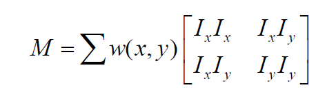
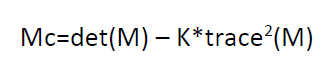
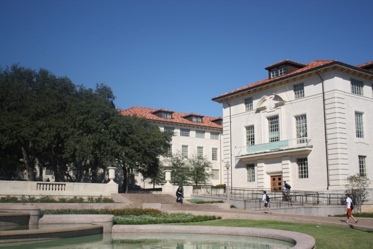
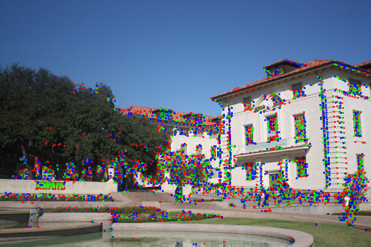
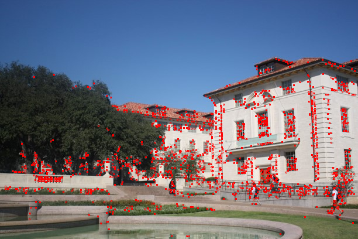
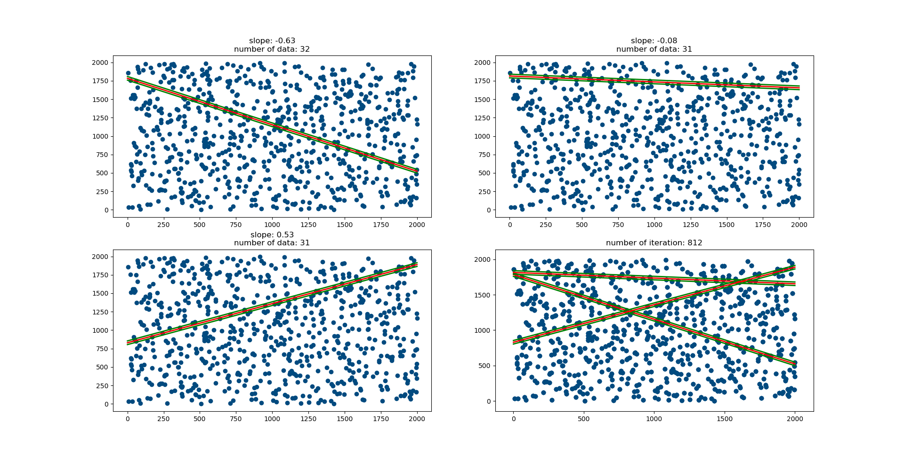

Computer Vision - Harris Corner Detection - RANSAC
==================================================

### Introduction
This project is created for implementing the _**Harris Corner Detection**_ and _**RANSAC**_ algorithms.

### Description
This project consist of 2 parts. In the following, details of the parts are described.

#### part1
At this part, the _**Harris Corner Detection**_ is implemented. Steps of the algorithm are given below:

1) _Ix_ and _Iy_ are found by using [-1 0 +1] and [-1 0 +1]T filters.
2) The following formula is applied to get _M_ matrix. 

3) Then, the following formula is applied to get _Mc_ value. 
 
In here, K can be selected between the 0.04 - 0.15.
4) Finally, if value of _Mc_ is greater than the threshold, it is marked as a corner pixel.

**Note:** Filter can be calculated according to given size. At above, algorithm is described with filter size of 3. If if you want to change filter size, you need to change only first step. For example, if you want to use filter whose size is 5, you need to  get _Ix_ and _Iy_ by using the following filters: [-2 -1 0 +1 +2] and [-2 -1 0 +1 +2]T.

In my project, three filters are used at the same time. Their sizes are 3, 5 and 7. Then, non_maximum suppression is applied to get most dominant corners.

At below results of the algorithm is being displayed:

1) The first picture is the original image.
2) The second picture is the result of application of the filters.
   * Red squares shows the results of the filter whose size is 3.
   * Green squares shows the results of the filter whose size is 5.
   * Blue squares shows the results of the filter whose size is 7. 
3) The third picture is the result of the non-maximum suppression.

First Image            |
---------------------- |
 |

Second Image            |
---------------------- |
 |

Third Image            |
---------------------- |
 |

#### part2
RANSAC (Random Sample Consensus) is a recursive method used to estimate the parameters of a mathematical model from data in a data set. RANSAC is a powerful method that works even when there is a lot of noisy data in the data set used, which is also used for noise detection. 

The method generally consists of the following steps:

1) Random data is selected from the entire data set
2) Calculate the parameters of the model using the selected data
3) Calculates the number of data from the data set in the whole data set
4) If the number of data suitable for the model is as desired, the algorithm ends
5) Steps 1-4 are repeated up to the preset number of steps
6) If no model is found in the number of preset steps, the algorithm ends

At this part, using the RANSAC, the best 3 lines in a set of randomly generated dots are found and shown. There are six global variables which you can change as you want their values:

1) _**randomIntegerLimit = 2000:**_ It is the maximum value of the randomly generated dots. 
2) _**numberOfPoints = 750:**_ It is the number of randomly generated dots. 
3) _**margin = 25:**_ It is used to include points that are close to line. If we have a line y = mx + n, all points will be included to line whose distance is lower than 25.
4) _**maxNumberOfIteration = 5000:**_ It is the maximum number of iteration of RANSAC algorithm. 
5) _**numberOfIteration = 0:**_ It is the number of iteration to find model. It is increased at every iteration.
6) _**minNumberOfSuitablePoints = 30:**_ It is the minimum number of points which are suitable to model. If third model is greater than this value, algorithm ends before number of iteration reaches the ‘maxNumberOfIteration’.

At below, there is a result of this part.

In the example, please note that iteration stopped at 812th iteration as written at the top of the forth plot. Because, number of suitable points of third line is 31 which is greater than ‘minNumberOfSuitablePoints’.

### License
Copyright 2019 Burak Kuyucu

Licensed under the Apache License, Version 2.0 (the "License");
you may not use this file except in compliance with the License.
You may obtain a copy of the License at

http://www.apache.org/licenses/LICENSE-2.0

Unless required by applicable law or agreed to in writing, software
distributed under the License is distributed on an "AS IS" BASIS,
WITHOUT WARRANTIES OR CONDITIONS OF ANY KIND, either express or implied.
See the License for the specific language governing permissions and
limitations under the License.

